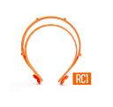
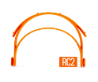
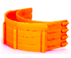

# Impressão

## Modelos para Impressão

Há dois modelos desenvolvidos pelo Prusa  

<table>
  <thead>
    <tr>
      <th style="text-align:left">Modelo</th>
      <th style="text-align:left">Tempo de impress&#xE3;o estimado (h)</th>
      <th style="text-align:left">Material estimado (g)</th>
      <th style="text-align:left">Link</th>
      <th style="text-align:left">Problemas na impress&#xE3;o Encontrados</th>
    </tr>
  </thead>
  <tbody>
    <tr>
      <td style="text-align:left">
        
      </td>
      <td style="text-align:left">
        
<del>1</del>
        

        
N&#xE3;o imprimir esse modelo
           
        

      </td>
      <td style="text-align:left">
        
<del>23</del>
        

        
N&#xE3;o imprimir esse modelo
           
        

      </td>
      <td style="text-align:left">
        
<del>Modelo RC1</del>
        

        
N&#xE3;o imprimir esse modelo

      </td>
      <td style="text-align:left">
        
<del>Pode acontecer o empenamento (warp). </del>
        

        
<del>Se ocorrer, utilize uma saia (brim) de 6mm</del>
        

        
N&#xE3;o imprimir esse modelo
           
        

      </td>
    </tr>
    <tr>
      <td style="text-align:left">
        
      </td>
      <td style="text-align:left">2</td>
      <td style="text-align:left">38</td>
      <td style="text-align:left">
        
<a href="https://www.prusaprinters.org/prints/25857-prusa-protective-face-shield-rc2">Modelo RC2</a>
        

        
Imprimir somente o headband RC2

        
N&#xC3;O imprimir o bottom reinforcement

      </td>
      <td style="text-align:left">
        
Pode acontecer o empenamento (warp).
           
        

        
Se ocorrer, utilize uma saia (brim) de 6mm

      </td>
    </tr>
    <tr>
      <td style="text-align:left">
        
      </td>
      <td style="text-align:left">2 (empilh&#xE1;vel)</td>
      <td style="text-align:left">40</td>
      <td style="text-align:left">
        
<a href="https://www.prusaprinters.org/prints/25857-prusa-protective-face-shield-rc3">Modelo RC3</a>
        

        
N&#xC3;O imprimir o bottom reinforcement
           
        

      </td>
      <td style="text-align:left">
        
Pode acontecer o empenamento (warp).
           
        

        
Se ocorrer, utilize uma saia (brim) de 6mm
           
        

      </td>
    </tr>
  </tbody>
</table>## Parâmetros de impressão 


ATENÇÃO: Não reduzir os parâmetros para ganhar tempo, isso vai custar qualidade


<table>
  <thead>
    <tr>
      <th style="text-align:left">Par&#xE2;metros</th>
      <th style="text-align:left">Valores</th>
    </tr>
  </thead>
  <tbody>
    <tr>
      <td style="text-align:left">Per&#xED;metros</td>
      <td style="text-align:left">3</td>
    </tr>
    <tr>
      <td style="text-align:left">Preenchimento</td>
      <td style="text-align:left">30%</td>
    </tr>
    <tr>
      <td style="text-align:left">Altura de Camada</td>
      <td style="text-align:left">0,25 a 0,30mm</td>
    </tr>
    <tr>
      <td style="text-align:left">Camadas Inferiores</td>
      <td style="text-align:left">3</td>
    </tr>
    <tr>
      <td style="text-align:left">Camadas Superiores</td>
      <td style="text-align:left">3</td>
    </tr>
    <tr>
      <td style="text-align:left">Brim</td>
      <td style="text-align:left">Recomendado de 6-10mm</td>
    </tr>
    <tr>
      <td style="text-align:left">Material</td>
      <td style="text-align:left">
        
Prefer&#xED;vel: PETG, Ultem,

        
Pode ser: PLA, ABS

      </td>
    </tr>
    <tr>
      <td style="text-align:left">Cor do filamento</td>
      <td style="text-align:left">Qualquer cor</td>
    </tr>
  </tbody>
</table>